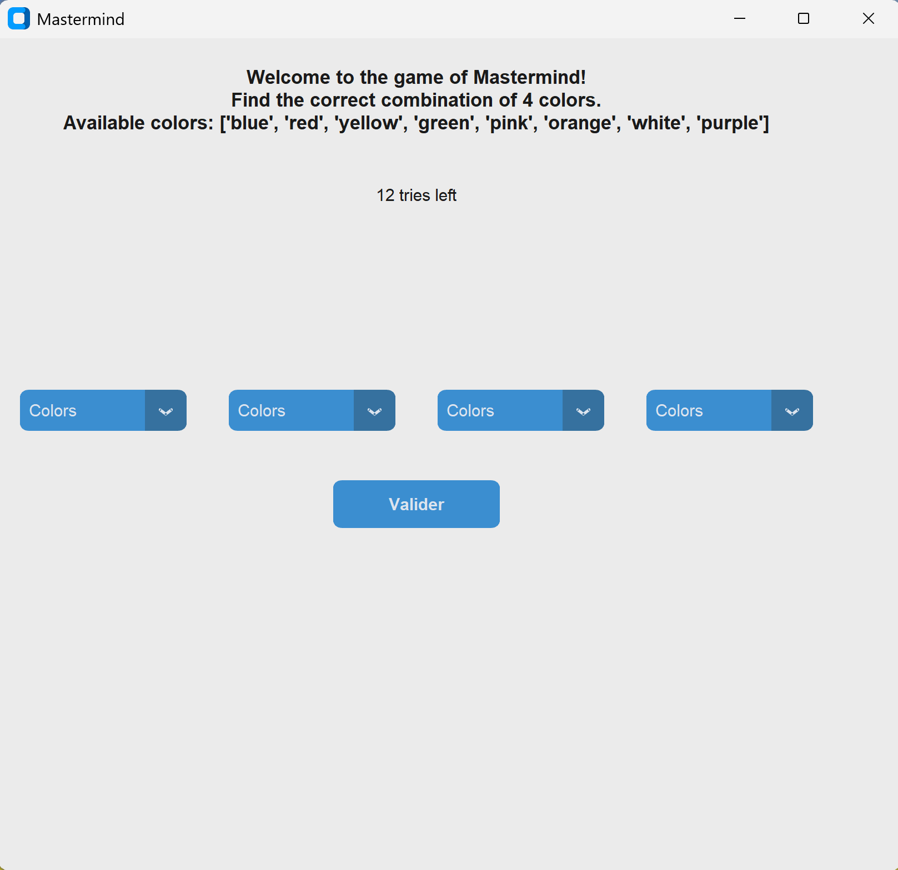

# Exercice 8 : Mastermind

Ce projet consiste à récréer le jeu du Mastermind, grand classique des jeux de société. Le but est de retrouver une combinaison de couleurs générées aléatoirement par l'ordinateur en moins de 12 essais

## Objectifs

- Commencer à utiliser python et se familiariser avec
- Implémenter des boucles et des conditions d'arrêt
- Faire de la logique algorithme et un système de vérification

## Fonctionnalités

- Génération aléatoire d'une combinaison secrète
- Suivi du nombres de tentatives par l'utilisateur
- Indications du placement des couleurs et retour différent en fonction du placement des couleurs
- Interface graphique fonctionnelle qui permet de jouer au jeu sans passer par le terminal python

## Apercu

## Instructions

1. git clone
2. Installer python ( la derniere version ) depuis le microsoft Store : [python_3.13](https://apps.microsoft.com/detail/9pnrbtzxmb4z?hl=fr-FR&gl=FR)
3. Ouvrer votre logiciel d'édition ( python ou Visual Studio Code) et sélectionner votre version installé de python du microsoft comme votre interpreter 
4. Installer le module customtkinter en faisant la commande : pip -install customtkinter depuis un terminal bash
4. Lancer le programme depuis votre logiciel